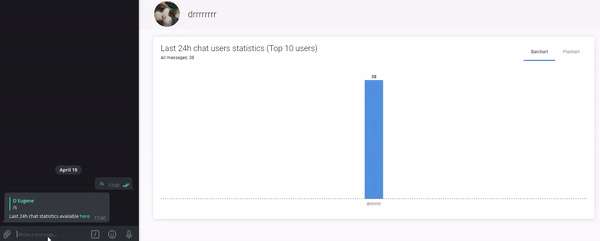

# Private realtime Telegram chat statistics

Next.js frontend for [`telegram-bot-app`](https://github.com/EugeneDraitsev/telegram-bot-app).
It shows live and historical chat activity over an authenticated WebSocket.
There is no public chat lookup: run `/s` inside a Telegram chat to receive a
short-lived link scoped to that chat.




## Configuration

Set `NEXT_PUBLIC_WEBSOCKET_URL` to the deployed API Gateway WebSocket URL. The
production endpoint is used as a fallback for the existing deployment.

### Owner admin dashboard

`/admin` is a private control room for searching and sorting known chats and
changing the AI allowlist and agent switch. Configure the Login Widget for the
bot in BotFather, register the exact callback URL, and add these server-only
environment variables to Vercel:

- `TELEGRAM_OIDC_CLIENT_ID` and `TELEGRAM_OIDC_CLIENT_SECRET` from BotFather;
- `TELEGRAM_OIDC_REDIRECT_URI`, for example
  `https://telegram-bot-ui.vercel.app/admin/callback`;
- `TELEGRAM_ADMIN_API_URL`, the deployed API Gateway stage base URL.

The client secret stays on the Next.js server. The admin session is stored only
in an HttpOnly, SameSite cookie and is never exposed to client JavaScript.

## Development

```bash
bun install --frozen-lockfile
bun run dev
```

Quality checks:

```bash
bun run audit
bun run lint
bun run tsc
bun run test
bun run build
```
