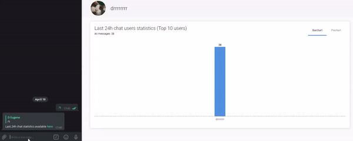

## Realtime telegram chat statistics 

Frontend for the telegram-bot-app based on React + [Next.js](https://nextjs.org/) with Incremental Static Regeneration [(ISR)](https://nextjs.org/docs/basic-features/data-fetching#incremental-static-regeneration) for chat pages

Demo with real chat data: [https://telegram-bot-ui.vercel.app/chat/-1001306676509](https://telegram-bot-ui.vercel.app/chat/-1001306676509)

## Bot Architecture

#### Repositories from scheme:

[telegram-bot-ui](https://github.com/EugeneDraitsev/telegram-bot-ui)

[telegram-bot-app](https://github.com/EugeneDraitsev/telegram-bot-app)

